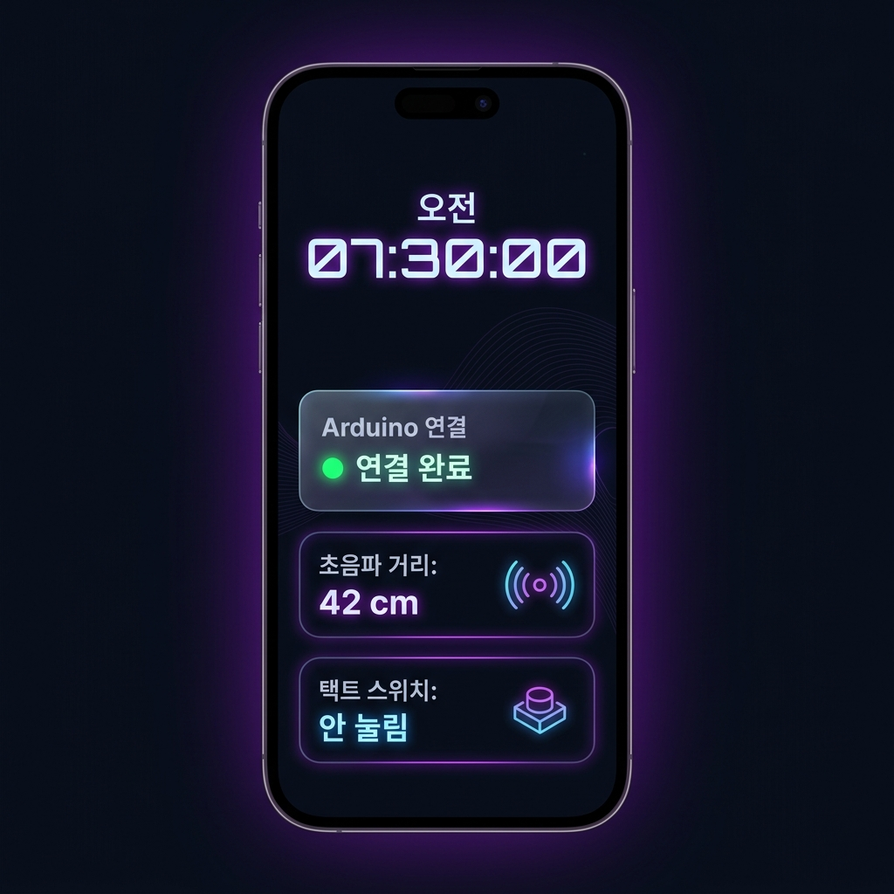
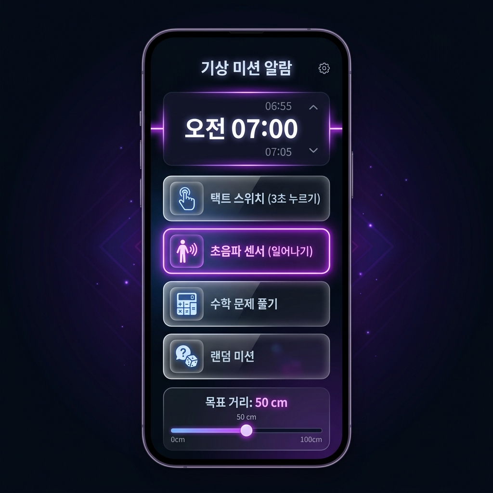
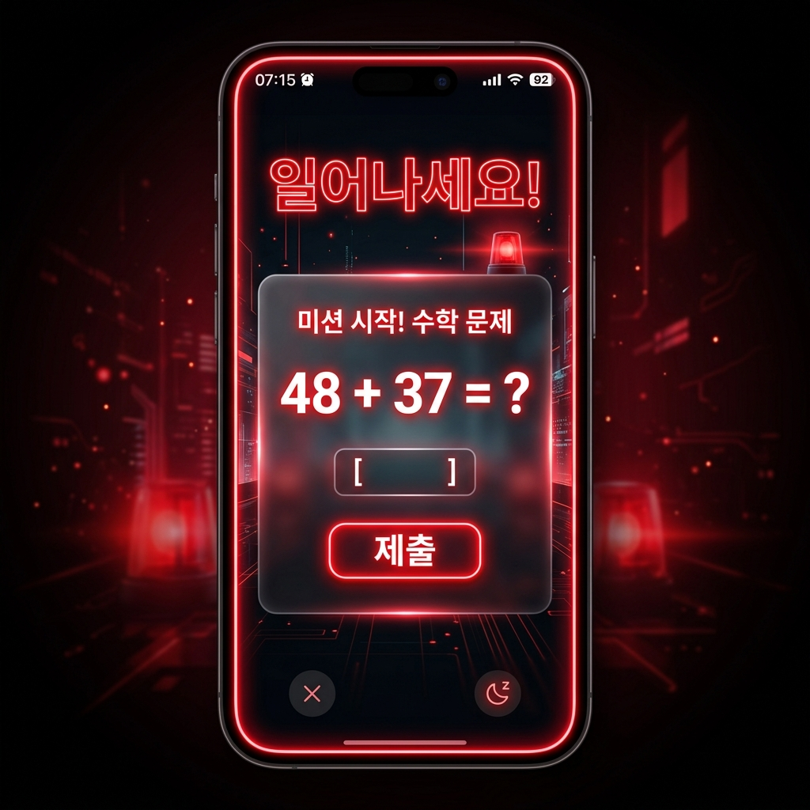

# [Design System] 웹 미션 알람 프로젝트 UI/UX 디자인 가이드

본 가이드는 아두이노와 연동되는 **'웹 미션 알람'** 모바일 웹 애플리케이션의 시각적 완성도와 일관된 사용자 경험을 제공하기 위한 디자인 사양서입니다. 
밤과 이른 아침의 눈 피로도를 낮추고 미래지향적인 감성을 자극하는 **네온 다크 테마(Neon Dark Theme)**와 **글래스모피즘(Glassmorphism)**을 메인 컨셉으로 합니다.

---

## 1. 디자인 컨셉 (Design Concept)

* **Futuristic Neon Dark**: 딥 차콜과 네이비 계열의 배경 위에서 자체 발광하는 듯한 형광/네온 컬러를 사용하여 인터랙티브 요소들을 강조합니다.
* **Glassmorphism**: 투명도와 배경 블러(Backdrop-filter: blur) 효과를 적용한 카드 인터페이스로 고급스러운 공간감을 연출합니다.
* **Mobile-Oriented (Card-based)**: 침대 옆 스마트폰이나 태블릿에 세워두고 사용할 수 있도록 최대 너비 `480px` 내외의 세로형 모바일 레이아웃에 최적화합니다.

---

## 2. 컬러 시스템 (Color System)

모든 요소는 아래 정의된 HEX 컬러 코드를 사용하여 일관된 톤앤매너를 유지합니다.

| 분류 | 역할 | 색상 코드 (HEX) | CSS 변수명 | 시각 예시 |
| :--- | :--- | :--- | :--- | :--- |
| **기본 배경** | 메인 어두운 배경 | `#0A0E17` | `--bg-primary` | ⬛ |
| **카드 배경** | 반투명 글래스 카드 | `rgba(25, 33, 50, 0.65)` | `--bg-card` | 🟦 (투명) |
| **활성 테두리 / 네온** | 포커스 및 네온 섀도우 | `#8A2BE2` | `--color-neon-purple`| 🟪 |
| **상태: 연결됨** | 연결 완료 (네온 그린) | `#00E676` | `--color-success` | 🟩 |
| **상태: 경고/알람** | 경고 및 알람 작동 (네온 레드) | `#FF1744` | `--color-danger` | 🟥 |
| **기본 텍스트** | 메인 본문 텍스트 (화이트) | `#FFFFFF` | `--text-primary` | ⬜ |
| **서브 텍스트** | 부가 설명/보조 텍스트 | `#8B9BB4` | `--text-secondary` | 🩶 |

---

## 3. 타이포그래피 (Typography)

스마트하고 미래적인 레이아웃을 완성하기 위해 **Google Fonts**의 무료 웹 폰트인 **Outfit**과 **Orbitron**을 조합하여 사용합니다.

```html
<!-- index.html 상단에 추가할 폰트 링크 -->
<link href="https://fonts.googleapis.com/css2?family=Orbitron:wght@500;700;900&family=Outfit:wght@300;400;600;700&display=swap" rel="stylesheet">
```

### 3.1 폰트 패밀리 역할 분담
* **본문 및 일반 UI**: `font-family: 'Outfit', sans-serif;`
  * 깔끔하고 가독성이 뛰어난 산세리프 폰트입니다.
* **시계 및 주요 수치 표시**: `font-family: 'Orbitron', monospace;`
  * 공상과학 느낌의 고정폭(Monospace) 폰트로, 시계 숫자가 움직일 때 레이아웃이 흔들리지 않게 잡아줍니다.

### 3.2 폰트 스케일 가이드
* **Digital Clock (현재 시간)**: `4rem (64px)`, Bold (700)
* **Title (H1)**: `1.8rem (28px)`, SemiBold (600)
* **Card Header**: `1.2rem (19px)`, SemiBold (600)
* **Body / Label**: `1rem (16px)`, Regular (400)
* **Status Badges / Small Info**: `0.85rem (13.6px)`, Medium (500)

---

## 4. 모바일 레이아웃 & 그리드 (Layout & Responsive Grid)

전체 너비는 모바일 기기 규격에 맞춰 중앙 정렬(Center Alignment)합니다.

* **최대 너비**: `max-width: 480px; width: 100%;`
* **마진 및 패딩**:
  * 외부 컨테이너 마진: `margin: 0 auto;`
  * 기본 패딩: `padding: 24px;`
* **카드 요소 스타일**:
  * 테두리 둥글기: `border-radius: 16px;`
  * 테두리 선 두께: `border: 1px solid rgba(255, 255, 255, 0.08);`
  * 섀도우: `box-shadow: 0 8px 32px 0 rgba(0, 0, 0, 0.37);`

---

## 5. 화면 구성 및 컴포넌트 가이드

### 5.1 대기 및 설정 화면 (Idle/Setup Screen)

#### [디자인 Mockup 참고]
| 메인 대시보드 화면 | 알람 설정 화면 |
| :---: | :---: |
|  |  |

* **디지털 시계**: 화면 최상단 중앙에 배치하며, 시리와 연결되었을 때 은은한 퍼플 네온 글로우(`text-shadow`) 효과를 적용합니다.
* **Web Serial 연결 카드**: 
  * '장치 연결하기' 버튼은 큰 사이즈로 제공하며 네온 테두리 효과를 가집니다.
  * 연결되면 녹색 도트 표시기(`--color-success`)와 함께 연결 상태 텍스트("연결 완료")가 나타납니다.
* **알람 설정 영역**:
  * 직관적인 드롭다운 및 시간 선택 휠(Time Picker) 구성.
  * 3가지 미션 선택은 큼직한 가로형 카드 라디오 버튼 형태로 구현하여, 손가락 터치가 편리하게 만듭니다. (선택된 카드는 보더가 `--color-neon-purple` 네온으로 빛남)

### 5.2 알람 작동 화면 (Alarm Trigger Mode)

#### [디자인 Mockup 참고]


* **사이렌 펄스 애니메이션 (알람 울림 효과)**:
  * 알람 작동 시, 웹 브라우저 전체 화면 외곽에 경고등 사이렌 효과(네온 레드가 안쪽으로 깜빡이며 페이드인/아웃)가 주기적으로 박동하는 박스 섀도우 펄스 애니메이션을 작동시킵니다.
* **미션 가이드 영역**:
  * 미션 종류에 따라 어떤 행동을 해야 하는지 직관적인 문구와 심볼(예: 스위치 아이콘, 움직이는 거리 표시 등)을 배치하여 당황하지 않고 미션을 진행할 수 있도록 유도합니다.

---

## 6. 미션별 특화 UI/UX

### 6.1 택트 스위치 미션 (3초 홀드)
* **동작 안내**: "아두이노 스위치를 3초 동안 꾹 누르고 있으세요."
* **UI 요소**: 
  * 중앙에 **3초 타이밍 서클 프로그레스 바(Circular Progress Bar)** 배치.
  * 스위치가 눌리기 시작하면 프로그레스 바가 점점 채워지며, 3초 완료 시 녹색으로 바뀌며 해제됩니다. 누르고 있다가 떼면 프로그레스 바가 부드럽게 0%로 줄어듭니다.

### 6.2 초음파 센서 미션 (일어나기)
* **동작 안내**: "침대에서 일어나 아두이노에서 멀어지세요."
* **UI 요소**:
  * 사용자가 지정한 '목표 해제 거리'를 가로형 타겟 라인으로 표시합니다.
  * 현재 초음파 센서 측정값을 실시간 게이지 바로 보여줍니다.
  * 현재 위치가 목표 거리 이상에 도달하면 게이지가 위험(Red) 상태에서 안정(Green) 상태로 전환되며 타이머가 작동합니다.

### 6.3 웹 수학 문제 미션 (두뇌 깨우기)
* **동작 안내**: "아래 수학 문제를 풀어 정답을 입력하세요."
* **UI 요소**:
  * 커다란 네온 텍스트 폰트로 연산 문제(예: `58 + 27 = ?`)를 표기합니다.
  * 모바일 키보드가 편하게 올라올 수 있도록 숫자 전용 입력 필드(`input type="number"`)와 넓은 '확인' 버튼을 제공합니다. 틀렸을 경우 빨간색으로 오답 텍스트 애니메이션(흔들기 효과)이 발생합니다.

### 6.4 랜덤 미션 모드
* **UI 요소**:
  * 알람 예약 시 '랜덤 미션' 카드는 물음표(`?`) 픽토그램과 보라색 그라디언트를 사용합니다.
  * 알람이 작동할 때, 3가지 미션 카드들이 빠른 속도로 롤링되다가 최종 선택된 미션 카드만 밝게 하이라이트되는 미니 룰렛 시각 효과를 제공합니다.

---

## 7. CSS 디자인 토큰 및 애니메이션 구현 예시

디자인 가이드라인을 실제 웹 코드로 즉시 구현하기 위한 주요 CSS 클래스 코드 조각입니다.

### 7.1 글래스모피즘 카드 스타일
```css
.glass-card {
  background: var(--bg-card);
  backdrop-filter: blur(12px);
  -webkit-backdrop-filter: blur(12px);
  border: 1px solid rgba(255, 255, 255, 0.08);
  border-radius: 16px;
  padding: 20px;
  box-shadow: 0 8px 32px 0 rgba(0, 0, 0, 0.3);
}
```

### 7.2 네온 텍스트 글로우 효과
```css
.neon-text-purple {
  color: #fff;
  text-shadow: 0 0 7px rgba(138, 43, 226, 0.8),
               0 0 10px rgba(138, 43, 226, 0.5),
               0 0 21px rgba(138, 43, 226, 0.3);
}
```

### 7.3 알람 사이렌 펄스 애니메이션 (알람 울림 효과)
```css
@keyframes siren-pulse {
  0% {
    box-shadow: inset 0 0 30px rgba(255, 23, 68, 0.3);
    border-color: rgba(255, 23, 68, 0.4);
  }
  50% {
    box-shadow: inset 0 0 80px rgba(255, 23, 68, 0.85);
    border-color: rgba(255, 23, 68, 1);
  }
  100% {
    box-shadow: inset 0 0 30px rgba(255, 23, 68, 0.3);
    border-color: rgba(255, 23, 68, 0.4);
  }
}

/* 알람 작동 시 전체 감싸는 최상단 wrapper에 추가할 클래스 */
.alarm-active {
  animation: siren-pulse 1.2s infinite ease-in-out;
  border: 4px solid rgba(255, 23, 68, 0.4);
  transition: all 0.3s ease;
}
```
