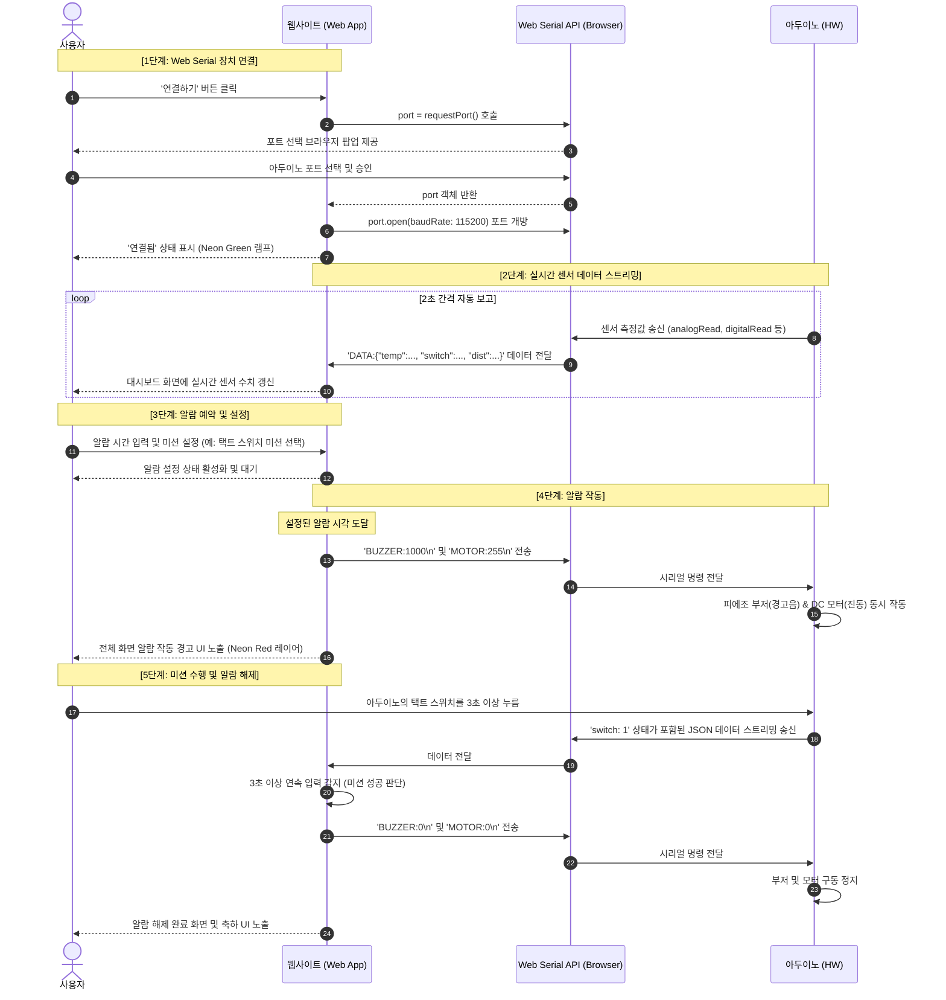

# [PRD] 웹 미션 알람 프로젝트 (Web Mission Alarm Project)

본 제품 요구사항 정의서(PRD)는 아두이노와 웹 브라우저를 Web Serial API로 연결하여, 지정된 알람 시간에 알람이 울리고 사용자가 설정된 하드웨어 및 소프트웨어 미션을 해결해야만 알람이 꺼지는 **'웹 미션 알람'** 시스템의 개발 요구사항을 정의합니다.

이 문서는 초보 개발자나 기획자도 쉽게 이해할 수 있도록 작성되었습니다.

---

## 1. 프로젝트 개요 (Overview)

* **목적**: 아두이노의 다양한 센서(초음파, 스위치)와 액추에이터(부저, DC모터)를 웹 브라우저와 실시간으로 연동하여, 사용자의 아침잠을 확실하게 깨워줄 수 있는 인터랙티브 미션 알람 서비스를 구축합니다.
* **통신 기술**: 웹 브라우저에서 직접 시리얼 포트에 접근하는 **Web Serial API**를 사용합니다. 별도의 서버 설치나 중간 드라이버 없이 웹브라우저 자체에서 아두이노와 직접 통신합니다.
* **핵심 컨셉**: 알람이 울리면 피에조 부저에서 경고음이 울리고, DC 모터가 회전하여 물리적인 진동/바람을 일으킵니다. 지정된 3가지 미션 중 직접 선택하거나 무작위(랜덤)로 지정된 미션을 성공적으로 완수해야만 부저와 모터가 정지합니다.

---

## 2. 전체 시스템 동작 흐름 (System Sequence Diagram)

웹 브라우저와 아두이노가 Web Serial API를 통해 연결되고, 알람 설정 후 미션을 수행하여 해제하는 전체 라이프사이클의 흐름 및 통신 프로토콜은 아래의 시퀀스 다이어그램과 같습니다.

---

## 3. 주요 기능 정의 (Key Features)

### 2.1 아두이노 연결 및 상태 관리
* **포트 연결/해제**: 웹페이지 내 '연결하기' 버튼 클릭 시 Web Serial API 브라우저 팝업을 띄워 아두이노 포트를 선택하고 연결합니다. '연결 해제' 버튼으로 통신을 안전하게 종료합니다.
* **상태 시각화**: 
  * **연결 대기**: 회색(Gray) 또는 깜빡이는 황색 상태 표시
  * **연결 성공**: 네온 그린(Neon Green) 테두리와 함께 '연결됨' 상태 표시
  * **연결 실패/통신 오류**: 네온 레드(Neon Red) 경고와 에러 메시지 팝업 노출

### 2.2 알람 및 미션 설정 UI
* **알람 시간 설정**: 사용자가 웹 UI에서 알람이 울릴 시(Hour), 분(Minute)을 설정할 수 있습니다. 
* **미션 선택**: 다음 3가지 미션 중 1개를 직접 활성화하거나, '랜덤 미션' 모드를 지정할 수 있습니다.
  1. **택트 스위치 미션**: 아두이노의 스위치를 3초 이상 누르면 완료
  2. **초음파 센서 미션**: 설정한 거리 임계값보다 멀어지면 완료
  3. **웹 수학 문제 미션**: 웹페이지에 나타난 수학 문제를 맞히면 완료
  4. **랜덤 미션**: 위 3가지 미션 중 1개가 무작위로 선택되어 알람 시점에 지정됩니다.
* **초음파 센서 임계값 설정**: 초음파 센서 미션 및 랜덤 미션에 대비하여, '미션 인정 거리(cm)'를 사용자가 입력 및 설정할 수 있는 슬라이더나 입력 창을 제공합니다.

### 2.3 알람 구동 및 해제 제어
* **알람 시작**: 설정 시간이 되면 웹브라우저가 아두이노로 알람 명령을 보내 **피에조 부저**와 **DC 모터**를 동시에 작동시킵니다.
* **알람 정지(미션 완료)**: 사용자가 설정한 미션을 완료하면 웹브라우저가 정지 명령을 보내 부저와 모터를 즉시 정지시키고 완료 축하 화면을 표시합니다.

---

## 4. 하드웨어 스펙 및 통신 프로토콜 (Hardware & Protocol)

아두이노에는 범용 펌웨어(web_serial_firmware.ino)가 업로드되어 있습니다. 정의된 하드웨어 연결 상태와 통신 규격은 아래와 같습니다.

### 3.1 하드웨어 핀 맵 (Arduino Connection Pin)
* **DC 모터 & LED**: 5번 핀 (`MOTOR_PIN` / `LED_PIN`)
* **피에조 부저**: 6번 핀 (`BUZZER_PIN`)
* **초음파 센서**: Trigger 13번 핀 (`TRIG_PIN`), Echo 12번 핀 (`ECHO_PIN`)
* **택트 스위치**: A3번 핀 (`TACT_SWITCH_PIN`, Pull-up 설정)

### 3.2 통신 규격 (Baud Rate: 115200)

#### 1) 웹 브라우저 → 아두이노 (송신 명령)
웹 애플리케이션에서 알람 제어를 위해 아두이노로 아래 명령어 문자열 끝에 줄바꿈 문자(`\n`)를 포함하여 전송합니다.

| 제어 대상 | 명령어 포맷 (String) | 설명 |
| :--- | :--- | :--- |
| **피에조 부저 켜기** | `BUZZER:1000` | 1000Hz 주파수의 경고음 발생 |
| **피에조 부저 끄기** | `BUZZER:0` | 소리 정지 |
| **DC 모터 작동** | `MOTOR:255` | 255 강도(최대 속도)로 모터 회전 |
| **DC 모터 정지** | `MOTOR:0` | 모터 정지 |

> **주의 사항**
> 명령 전송 시 끝에 반드시 개행 문자 `\n`이 포함되어야 아두이노 펌웨어에서 명령을 정상적으로 인식합니다.
> 명령 성공 시 아두이노는 `ACK:BUZZER SUCCESS` 또는 `ACK:MOTOR SUCCESS` 응답을 반환합니다.

#### 2) 아두이노 → 웹 브라우저 (수신 데이터)
아두이노는 매 2초마다 시리얼 통신을 통해 아래 포맷의 JSON 형태의 센서 정보 데이터를 전송합니다. 웹 브라우저는 이 문자열을 파싱하여 실시간으로 모니터링합니다.

* **수신 데이터 포맷**: `DATA:{"dist":거리,"switch":스위치상태,...}`
* **설명**: 범용 펌웨어는 온습도, 조도 등의 추가 데이터를 함께 전송하지만, 본 웹 애플리케이션은 요구사항에 정의된 **초음파 센서 거리(dist)**와 **택트 스위치 상태(switch)** 데이터 필드만 추출하여 사용하고 그 외의 데이터는 무시합니다.
* **미션 연동에 필요한 데이터 필드**:
  * `"dist"`: 초음파 거리 센서 측정값 (단위: cm)
  * `"switch"`: 택트 스위치 상태 (`0` = 안 눌림, `1` = 눌림)

---

## 5. 미션 시나리오 상세 설계 (Mission Scenarios)

알람이 구동되면 웹 화면은 '미션 수행 중' 화면으로 전환되며 아래 각 시나리오에 따라 조건 충족 여부를 판단합니다.

### 4.1 미션 1: 택트 스위치 누르기 미션
1. **시작**: 알람이 시작되어 아두이노 부저와 모터가 구동됩니다.
2. **동작**: 사용자는 아두이노 브레드보드 상의 택트 스위치를 3초 이상 누릅니다.
3. **판단**: 웹 앱은 수신 데이터 중 `"switch"` 값이 `1`로 연속해서 3초 이상 들어오는지 판단합니다. (예: 2초 간격으로 보고되므로 아두이노 펌웨어 스펙상 2회 연속 혹은 웹 브라우저 단의 정밀 타이머/카운터 기준 3초 이상 누르고 있는 상태를 유지해야 완료로 판정합니다. 중간에 누르기를 떼면 타이머가 리셋됩니다.)
4. **결과**: `BUZZER:0\n` 및 `MOTOR:0\n` 명령을 아두이노에 순서대로 발송하여 알람을 해제합니다.

### 4.2 미션 2: 초음파 거리 센서(일어나기) 미션
1. **시작**: 알람이 작동합니다.
2. **설정**: 사용자는 침대 헤드나 베개 근처에 초음파 센서를 배치해 두었습니다. 미리 웹에서 '해제 거리 임계값'을 **50cm**로 설정했다고 가정합니다.
3. **동작**: 사용자가 몸을 일으키거나 침대 밖으로 멀어지면서 센서가 측정하는 `"dist"` 값이 증가합니다.
4. **판단**: 웹 앱은 수신 데이터 중 `"dist"`의 값이 설정 임계값(50cm) 이상으로 유지되는지 판단합니다. (순간적인 오차 노이즈 방지를 위해 `dist >= 설정값` 조건이 2회 연속 감지되면 확정하도록 설계 권장)
5. **결과**: 조건 충족 시 `BUZZER:0\n` 및 `MOTOR:0\n` 명령을 송신하여 알람을 해제합니다.

### 4.3 미션 3: 웹 수학 문제 풀기 미션
1. **시작**: 알람이 작동합니다.
2. **동작**: 웹 화면 중앙에 사칙연산 문제가 생성됩니다. (예: `48 + 72 = ?`, `14 * 6 = ?` 등 잠을 깨우기 위해 너무 쉽지 않은 덧셈/뺄셈/곱셈 혼합형 문제 제공)
3. **판단**: 사용자가 웹페이지 내 입력창에 답을 작성하고 '제출' 버튼을 누릅니다. 입력값과 실제 정답이 일치하는지 판단합니다.
4. **결과**: 정답 시 `BUZZER:0\n` 및 `MOTOR:0\n` 명령을 송신하여 알람을 해제합니다.

### 4.4 랜덤 미션 시나리오 (Random Mission Mode)
1. **시작**: 알람 시간이 되어 아두이노 부저와 모터가 구동됩니다.
2. **선택**: 알람이 구동되는 시점에 웹 애플리케이션 내부에서 난수를 발생시켜 3가지 미션(택트 스위치, 초음파 센서, 웹 수학 문제) 중 1개를 무작위로 선택합니다.
3. **안내 및 동작**: 화면에 "오늘의 랜덤 미션: [선택된 미션 이름]"을 크게 노출하고, 사용자가 해당 미션 동작을 수행하도록 유도합니다. (초음파 거리 임계값은 사용자가 설정해 둔 기본 설정값 적용)
4. **판단 및 해제**: 무작위 선택된 미션의 성공 조건이 충족되면 `BUZZER:0\n` 및 `MOTOR:0\n` 명령을 송신하여 알람을 해제합니다.

---

## 6. UI/UX 및 디자인 가이드 (UI/UX & Design Guidelines)

제품의 첫인상을 극대화하고 프리미엄 다크 테마를 지향하여 아래의 디자인 요구사항을 만족해야 합니다.

### 5.1 시각적 스타일
* **테마**: 심야 및 이른 아침 눈의 피로를 덜어줄 수 있는 **딥 다크 테마(Deep Dark Theme)**
* **컬러 팔레트**: 
  * 메인 배경: 짙은 차콜/네이비 (`#0D1117`, `#161B22`)
  * 네온 효과 포인트: 연결됨 (Neon Green: `#2EA043`), 알람 울림/에러 (Neon Red/Pink: `#FF3860`), 포인트 요소 (Neon Purple: `#8A2BE2`)
* **디자인 기법**: 카드 인터페이스에 글래스모피즘(Glassmorphism - 반투명 블러 효과) 적용하여 고급스러운 레이어 구성

### 5.2 화면 레이아웃 구성
1. **Header / Connection Area**:
   * 프로젝트 타이틀 및 Web Serial 포트 연결/해제 버튼
   * 실시간 통신 상태 램프 (아이콘 + 네온 애니메이션)
2. **Alarm & Mission Setup Area (설정 영역)**:
   * 현재 시간 표시 (디지털 시계 모듈 스타일)
   * 알람 예약 입력창 (Time Picker)
   * 3가지 미션 선택 카드 (라디오 버튼 또는 클릭 카드 형태)
   * (초음파 미션 선택 시만 활성화) 임계 거리 입력/슬라이더 영역
3. **Live Status Area (센서 모니터링 영역)**:
   * 아두이노에서 수신되는 초음파 거리 센서 값과 택트 스위치 상태를 실시간 시각화하여 대시보드로 보여줍니다.
4. **Alarm Trigger Mode (알람 중 화면)**:
   * 알람 조건이 충족되면 전체 화면에 경고성 붉은 네온 오버레이 애니메이션 제공
   * 현재 수행해야 할 미션 지시사항 및 웹 미션 입력 상자 크게 배치

---

## 7. 오류 상황 및 안전장치 (Error & Exception Handling)

1. **포트 연결 실패 및 유실**:
   * 웹 브라우저에서 포트를 찾지 못하거나 케이블이 분리되었을 때, 상단에 경고 모달을 띄우고 상태를 "연결 끊김(Disconnected)"으로 강제 변경합니다.
2. **데이터 파싱 에러**:
   * 시리얼 포트로 들어오는 문자열이 깨지거나 JSON 형식이 아닐 때 (`DATA:` 접두사가 없거나 잘린 데이터 등), 시스템 다운 없이 해당 데이터 프레임만 무시하고 오류 카운트를 높여 사용자에게 '수신 오류 감지' 상태를 알립니다.
3. **웹 페이지 새로고침 발생**:
   * 만약 사용자가 알람이 울릴 때 웹페이지를 새로고침하면 Serial 연결이 끊기며, 아두이노는 마지막에 받은 명령 상태(`MOTOR:255`, `BUZZER:1000`)를 유지하므로 계속 알람이 울리게 됩니다. 
   * 이를 방지하기 위해 웹 페이지 로드 시 "이미 연결된 포트가 있는지 확인하고 즉시 연결 시도" 혹은 "연결 시작 시 경고 문구 출력" 등을 고려하고, 다시 연결되었을 때 사용자가 '알람 수동 종료' 처리를 할 수 있는 비상 버튼을 화면에 제공합니다.

---

## 8. 단계별 개발 순서 (Development Roadmap)

초보자도 막힘없이 시스템을 완성할 수 있도록 기능을 점진적으로 살 붙여나가는 3단계 개발 로드맵입니다.

### 1단계: 메인 화면 제작 (UI/UX Foundation)
* **목표**: 서비스의 외관을 디자인하고, 센서 대시보드와 알람 제어용 정적 마크업을 완성합니다.
* **구현 기능 목록**:
  * [ ] **글래스모피즘 다크 테마 CSS**: 딥 다크 배경 및 반투명 블러 효과 카드 스타일링 정의
  * [ ] **디지털 시계 모듈**: JavaScript `setInterval`을 이용해 현재 시/분/초를 실시간 업데이트하여 노출
  * [ ] **설정 UI 레이아웃**: 알람 시간 Picker, 3가지 미션 카드 목록, 초음파 거리 설정 슬라이더 마크업
  * [ ] **대시보드 영역**: 초음파 거리와 택트 스위치 상태를 표시할 센서 모니터링 영역 및 연결 상태 표시 램프 제작
  * [ ] **알람 경고 오버레이**: 알람이 작동했을 때 화면 전체에 붉은 네온 조명과 함께 덮어씌워질 오버레이 화면 레이아웃 디자인

### 2단계: 아두이노 연결 및 알람 기능 (Web Serial API & Alarm Trigger)
* **목표**: 아두이노 범용 펌웨어와의 시리얼 연결을 성립시키고, 설정된 시간에 경보가 작동하도록 로직을 연결합니다.
* **구현 기능 목록**:
  * [ ] **Web Serial 연결부**: 브라우저 포트 요청 및 `115200` 보레이트 포트 열기/닫기 로직 작성
  * [ ] **실시간 센서 데이터 수신**: 아두이노가 2초마다 전송하는 `DATA:{...}` 접두 문자열 파싱 후 JSON 형태로 변환
  * [ ] **대시보드 연동**: 파싱된 데이터(초음파 거리 및 택트 스위치 상태)를 1단계에서 만든 대시보드에 실시간 반영
  * [ ] **알람 타이머 로직**: 실시간 시간과 설정 알람 시간을 매 초 비교하여 트리거 판단
  * [ ] **알람 전송 (트리거)**: 지정 시각 도달 시 아두이노로 `BUZZER:1000\n` 및 `MOTOR:255\n` 전송하고 화면을 1단계의 알람 오버레이로 전환

### 3단계: 알람 해제 미션 및 예외 처리 (Mission Clears & Safety)
* **목표**: 다양한 미션을 통해 알람 신호를 정지시키고, 예외 상황에 대한 안전장치를 연동하여 서비스를 완성합니다.
* **구현 기능 목록**:
  * [ ] **택트 스위치 미션 로직**: 수신 데이터의 `switch`가 `1`인 상태를 확인하여 누적 3초 이상 누름을 판단하고 성공 처리
  * [ ] **초음파 센서 미션 로직**: 수신 데이터의 `dist` 값이 사용자가 지정한 임계값보다 커진 상태가 2회 연속 감지되면 성공 처리
  * [ ] **웹 수학 문제 미션 로직**: 무작위 두 자리 사칙연산 출제 시스템 및 제출 답안 일치 여부 판별 검증기 구현
  * [ ] **랜덤 미션 분기기**: '랜덤 미션' 옵션 활성화 시 알람 시점에 1~3번 미션 중 무작위 1종을 할당하는 기능
  * [ ] **알람 해제 전송**: 미션이 성공 판정되는 즉시 아두이노로 `BUZZER:0\n` 및 `MOTOR:0\n` 신호를 차례로 발송하여 하드웨어 정지
  * [ ] **연결 유실 예외 처리**: 시리얼 포트 단선 감지 시 경고 알림 팝업 작동 및 재연결 기능, 비상 정지 수동 버튼 활성화
